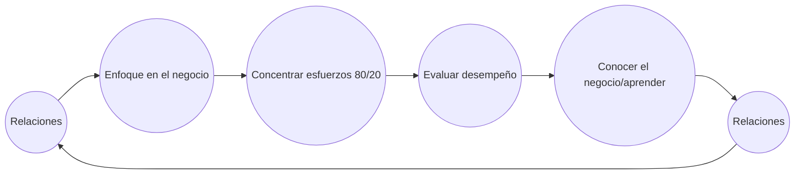
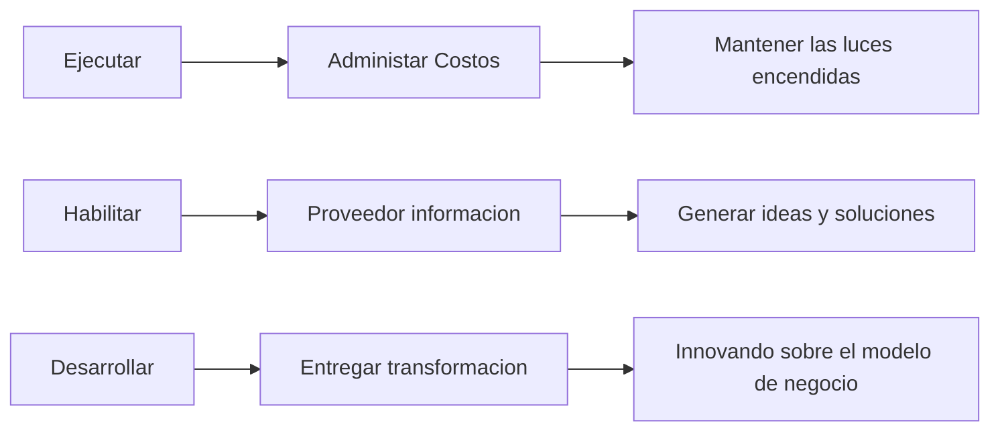

# Rol del Cio: Habilidaes Gerenciales

## Roles

### Director de Tecnologia de la Informacion

Mas alto respondable de las tecnologias de la informacion y comunicacion para apoyar los objetivos institucionales. Atiende requerimientos de forma estandar.

Reporta a la **Gerencia General** , Gerencia de Operaciones y/o a Gerencia de Administracion y Finanzas.

### CIO

Plantea alternativas de solucion a los requerimientos que recibe. Un CIO debe centrarse en comprender el negocio al cual apoya. Es vita en este sentido, que conozca al detalle el funcionamiento de la emrpesa, los procesos que se realizan en esta.

Con el objetivo de simplificar la forma en que opera la compañia , sirviendose de la tecnologia.

Debe saber explicar y vender a sus pares en la organizacion los beneficios de sus proyectos tecnologicos pero en un lenguaje de usuario.
Debe seleccionar y retener profesionales cada vez mas dificiles de encontrar con personalidades cada vez mas dedicadas.
Seleccionar y contratar  buenos proveedores de servicios
Administrar y dirigir proyectos de implementacion tecnologica.

#### Mision

Proveer vision tecnologica y mantener el liderazgo en el desarrollo e implantacion de inciativas en materia de aplicacion de las tecnologias de informacion y comunicaciones que mantengan el liderazgo de la organizacion en un entorno cambiante e intensamente competitivo.

#### Rol

Asesor - Ejecutor - Generador - Identificar - Consultor

Director - Productor - Coordinador - Monitor - Mentor - Facilitador - Innovador - Broker

#### Competencias

#### Habitos

1. Proactivo
2. Comenzar con un fin en mente
3. Establecer primero lo primero
4. Pensar en ganar y ganar
5. Busca primero comprender y luego ser comprendido
6. Sinergizar
7. Afilar la sierra

## Habilidades Gerenciales

### Estilos

Coercivo        =>  Haz lo que te digo
Orientativo     =>  El objetivo es aquel
Afiliativo      =>  Buen Ambiente
Participativo   =>  Danos tu opinion
Imitativo       =>  Haz lo que yo
Capacitador     =>  Luegares a ese nivel

### Que se debe hacer

### Mision de las TIC en organizaziones

Competir - Ganar Carrera - Desarrollar

## Lectura: Problemas que enfrentan los CIO
