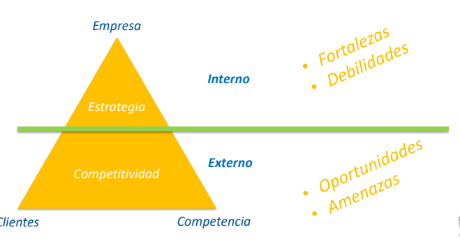
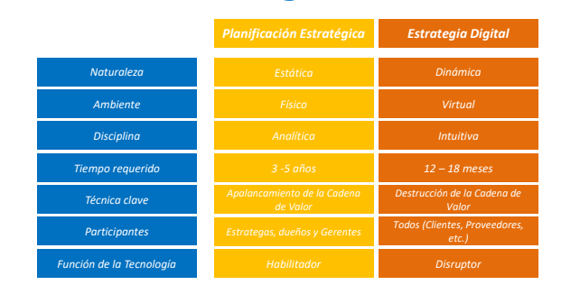

# Cadena de Valor Estrategia de TIC

## Estrategia

Acciones planificadas que se llevan a cabo para cumplir en determinado proposito

Permiten lograr una ventaja competitiva

## Fuerzas que determinan la estrategia de la empresa

Desatan una experimentacion desenfrenada por parte de las compañias de sus clientes

Orienta al analisis del efecto de la TI

## Concepto de Valor

Una empresa rentable si el valor obtenido es mayor al valor invertido en producir el producto.

## Cadena de Valor

Herramienta de analisis de actividades realizadas por una empresa q
de como interactuan para generar valor.

Desagrega la empresa hasta las actividades estratégicamente más importantes.

Permite entender el comportamiento de los costos y el potencial para mejorar sus ventajas competitivas.

## Fuerzas competitivas de porter

1. Amenaza de nuevos Competidores
2. Poder de negociación de los proveedores
3. Rivalidad y competencia del mercado
4. Poder de negociación de los clientes
5. Amenaza de nuevos productos y servicios

## Análisis del efecto de las TIC en la adopción de decisiones estratégicas

- ¿Se puede utilizar las TIC para realizar reingeniería sobre las actividades fundamentales de valor? ¿Cómo?
- ¿Pueden las TIC cambiar la naturaleza de las relaciones y el equilibrio de poder entre compradores y proveedores? ¿Cómo?
- ¿Pueden las TIC reducir las barreras de entrada? ¿Cómo?
- ¿Pueden las TIC aumentar o reducir los costes de sustitución? ¿Cómo?
- ¿Pueden las TIC aumentar el valor de los productos y servicios existentes o crear nuevos? ¿Cómo?

## Estrategia de las TIC en la Empresa

## Planificación Estratégica y Estrategia Digital

