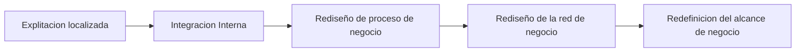
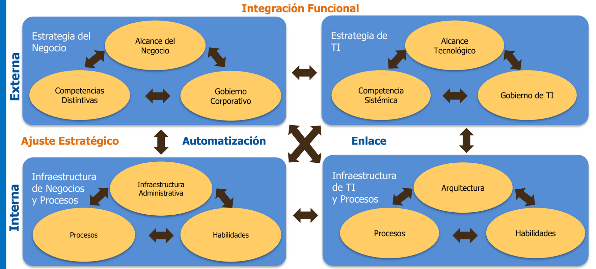
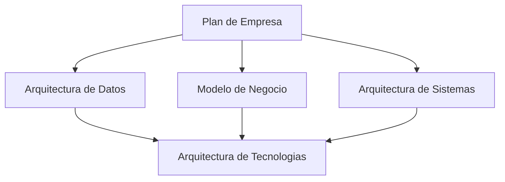

# Alineamiento Estratégico & Plan Estratégico de TIC - PETI

## Nuevo rol de las TIC

- Habilitador esecnial para la nueva organizacion
- Innovar, no para automatizar?
- Pensamiento inductivo reconocer la solucion
- Romper las viejas reglas

### Niveles de TIC - Transformación del Negocio

### Alineamiento Estratégico de TIC

El negocio soloicita cambios y el area de TI se encarga de realizar un entrega de valor

### Modelo de Alineamiento de TIC con la Estrategia de la Empresa

Los objetivos del area de TI (Estrategicos, tacticos y operacionales) deben estar alineados a los objetivos y estrategias corporativas.

### Valoración de los Proyectos de TIC

La desintegracion del area de TI provoca fallos en la entrega de informacion y los procesos de negocio

## Modelo de alinemamiento estrategico

## Planeamiento Estratégico de Tecnología de Información (PETI)

- Ordenar los esfuerzos de las TIC.
- PETI proceso de planeacion, donde las estrategias sufren una continua adaptacion, inovacion y cambio.

### Contenido

- Misión
- Visión
- Objetivos
- Metas
- Filosofía
- FODA IT
- Estructura Organizacional
- Funciones, rol y procesos de TI
- Estrategias
- Factores críticos de éxito
- Informe de Auditoría
- Diseño de solución
- Plan de Implementación

### Beneficios

Gestion Eficaz - Mejora de la comunicacion - Identifica Oportunidades - Reduce los esfuerzos e inversion - Facilita compartir informacion

