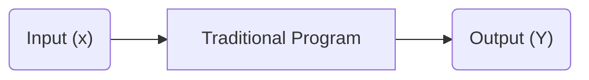
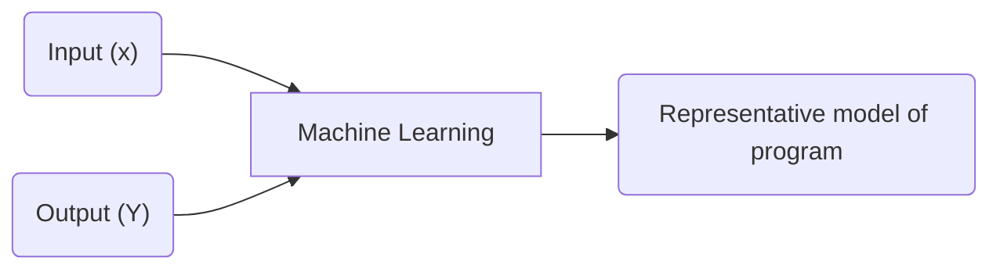
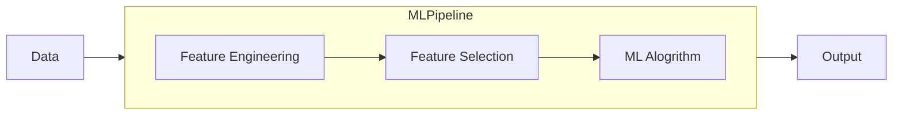
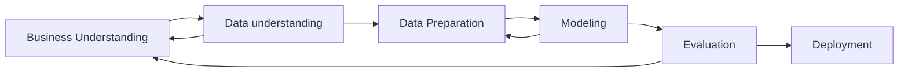
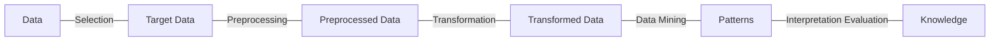

# Proyectos de Software Inteligente

## IA, ML, Deep Learning y Data Science

Sirve como termino general para ML y Deep Learning se define como dar a las computadoras la capacidad de imitar el comportamiento humano, particularmente funciones cognitivas.

## Software tradicional y ML

> Mientras que la programación tradicional se basa en reglas, ML tiene como objetivo aprender patrones inherentes (Sarkar et al. 2018)

## Ciclo de vida de proyectos ML

Cross Industry Standard Process for Data Mining (CRISP-MD) "Modelo abierto de proceso para aplicar minería de datos".

## Ciclo de vida de Proyectos ML

Knowledge Discovery in Databases, proceso para descubrir patrones en volumenes de base de datos.

## Tipo de ML

Pendiente
