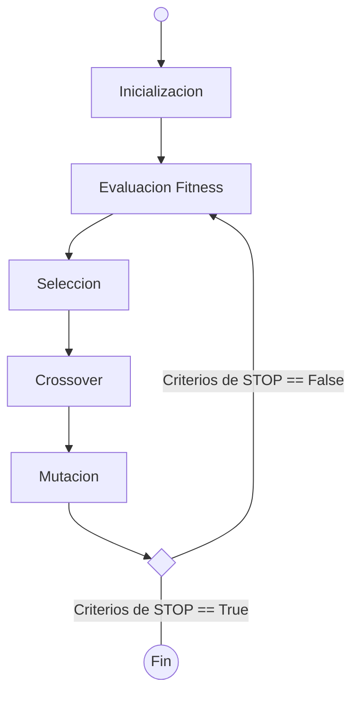

# Algoritmos Geneticos

## Origen

> Tenemos como un antecedente a *Charles Darwin* con su libro **El origen de las especies**.

Los algoritmos geneticos reflejan un proceso de selecciona natural en el solo **solo los individuos mas aptos** pasan a la siguiente generacion.

## Como funcionan?

### Seleccion natural

Proceso de seleccion que inicia con la seleccion de los individuos mas aptos de una poblacion.

Estos producen descendientes que heredan las caracteristicas de los padres y se agregaran a la proxima generacion.

Si los padres tienen una mejor condicion fisica, sus hijos seran mejores que los padres y tendran mas posiblidades de sobrevivir.

Este proceso sigue iterando y al final se encontrara un generacion con las personas mas aptas.

> Consideramos un conjunto de soluciones para un problema y seleccionamos el conjunto de las mejores entre ellas.

## Fases

La secuencia se repite para producir individuos mejores en cada nueva generacion.
La poblacion tiene un tmno fijo. A medida que se forman las nuevas generaciones, mueren los individues con menor aptitud lo cual genera mas espacio para nuevas "crias".



### Poblacion Inicial

Comienza con un conjunto de individuos (**poblacion**). Cada uno es una solucion al problema que deseamos resolver (inicialmente se establecen de forma aleatoria).

Un **individuo** se caracacteriza por tener un conjunto de parametros/variables conocidos como genes. Los genes se unen para formar un cromosoma/solucion

Los valores del cromosma estan en binario, son una secuencia de 0 y 1.

```pseudo
{
    A1[0,0,0,0,0] //Gen     A2[1,1,1,1,1] //Cromosoma       A3[1,0,1,0,1]
} poblacion
```

### Funcion Fitness

Determina la aptitud de un individuo para competir con otros individuos.
Da una puntuacion de aptitud fisica a cada individuo.
La probablidad de que un individuo sea seleccionado para reproduccion se basa en su puntacion de aptitud.

```pseudo
Individuo   => ptj
A1[0,0,0,1] => 10
A2[0,1,0,1] => 13
A3[1,1,1,1] => 1
A4[1,1,0,1] => 4
```

### Seleccion

Se seleccionan los individios mas aptos y dejarlos pasar sus genes a la siguiente generacion.
Pares de padres son seleccionados en funciona de su puntuacion.

```pseudo
Individuo   => ptj
A1[0,0,0,1] => 10 
A2[0,1,0,1] => 13
A3[1,1,1,1] => 1 [R.I.P]
A4[1,1,0,1] => 4 [R.I.P]
```

### Cruces/Crossover

- Para cada par de padres se elige un punto de cruce al azar dentro de los genes.

```pseudo
       |=>Punto de cruce
A1[0,0,|0,0]
A2[1,1,|1,1]
```

- La descendencia se crea interncambiando genes de los padres entre ellos hasta que se alcanza el punto de cruce.

```pseudo
nueva descendencia
A3[0,0,1,1]
A4[1,1,0,0]
```

### Mutacion

Tiene por objetivo mantener la diversidad genetica. Ocurre en uno o mas lugares del cromosoma y en muchos cromosomas en una generacion. Implica la inversion o cambio de algunos de los genes.

```pseudo
A5[0,0,1,1] => A5[1,0,0,1]
```

El algoritmo termina si la población ha convergido (no produce descendencia que sea significativamente diferente de la generaciones antiguas).

## Ventajas

- Robustos: Ampliamente probados y con resultados de optimizacion de calidad.
- Paralelos: tiene descendencia multiple, pueden explorar multiples espacios de soluciones a la vez.
- Optimizacion sobre espacios de estados grandes: permite evaluar implicitamente su efectividad al evitar muchos optimos locales y descubrir el optimo global.

## Limitaciones

- Representancion del problema: El lenguaje para especificar soluciones candidatas debe ser robusto, debe ser capaz de toler cambios aleatorios que no produzcan errores faltaes
- Escribir erradamente la función de aptitud: Elegir mal la funcion de aptitud o se define de manera inexacta, puede que el algoritmo genecito sea incapaz de encontrar una solucion
- Convergencia prematura: Si un individuo que es mas apto que la mayoria de sus competidores emerge muy pronto en el curso de la ejecucion, se puede reproducir tan abuntandte. provocando que el algoritmo converja hacia el óptimo local que representa ese individuo (sesgo). Esto es un problema especialmente común en las poblaciones pequeñas.

## Ejemplos

### N Reinas

### Optimizacion de una Funcion

Teniendo la función f(x) =x2 encontrar el valor de x que alcance su valor máximo, restringiendo a la variable x a tomar valores  comprendidos entre 0 y 31.


