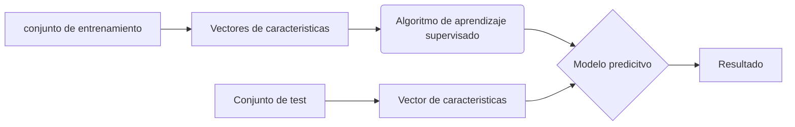
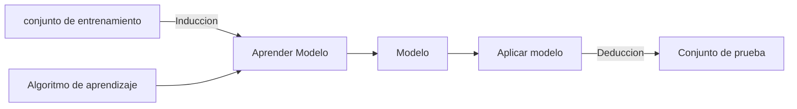
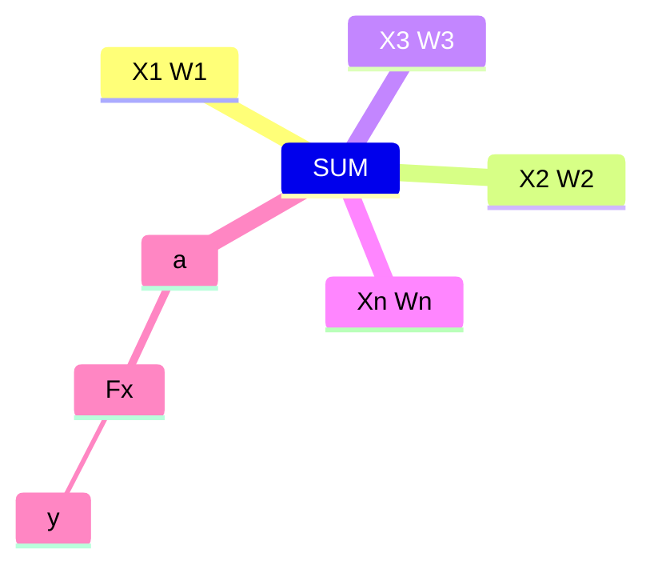
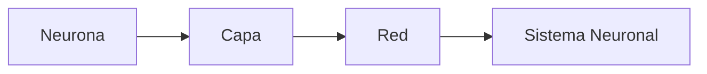
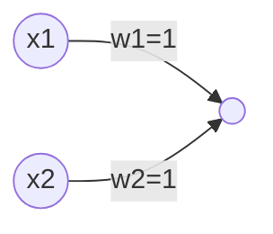

# Redes Neuronales y sus aplicaciones

## Aprendizaje supervisado

Tecnica aplicada para el aprendizaje automatico y la mineria de datos.

Busca clasficar o predecir el valor correspondientes a cualquier objeto de entrada valida despues de haber visto una serie de ejemplos Datos de entrenamiento.

### Clasificacion

Predice el valor de un atributo categorico (discreto o nominal).

### Prediccion

Usado para modelar funciones que toman valores continuos.
Predecir valores numericos desconocidos.

## Modelo supervisado

### Modelo de clasificacion o modelo de prediccion

### Arquitectura de la neurona artificial

$$
a = w_1x_1+w_2x_2,...,w_nx_n+w_0
\newline
y = f(a)
$$

### Funciones de activacion para la neurona

- Limitador fuerte
- Limitador fuerte simietrico
- Lineal Positivo
- Lineal
- Lineal Saturado
- Lineal Saturado Simetrico
- Sigmoidal Logaritmico
- Tangente Sigmoidal
- Hiperbolica
- Competitiva

### Funciones

### Algoritmo de Perceptron Unicapa

1. Iniciar valores aleatorios para pesos y umbral
2. Modificacion de los pesos hasta encontrar el hiperplano discriminante
    1. Seleccionar un ejemplo x del conjunto de entrenamiento
    2. Se calcula la salida de la red:
    $$
    a=w_1x_1+w_2x_2,...,w_nx_n+w_0
    \newline
    y=f(a)
    $$
    3. Si $y\not=d(x)$ se modifican los pesos: $w_i(t+1)=w_i(t)+a(d(x)-y)x_i$
    4. Repertir epocas desde el paso 2.i hasta cumplir un criterio de parada.
        1. $a$ es factor de aprendizaje.
        2. $d(x)$ clase o etiqueta esperada.

### Objetivo de Perceptron Unicapa

Busca clasificar en dos clases.
Usa una función de activación ejemplo limitador fuerte simétrico.

Umbral de atenuador $= \theta$

ecuacion del hiperplano:

$w_1x_1+w_2x_2+\theta=0$

$x_2=-\frac{w_1}{w_2}x_1-\frac{\theta}{w_2}$

forma una recta

---------
### Ejemplo

factor de aprendizaje $a=0.3$

Cuando tiende a 0 es mas lento va de cero a 1

- Diseñar red nueronal que corresponde

$\theta = 0.5$

- Presentar el hiperplano discriminante de clasificacion precio a entrenamiento

Se toma un punto cualquier por ej: x1 = -1 tomando la ecuacion del hiperplano x2 = 0.5

Vemos que no clasifica correctamente, al hacer pruebas con el conjunto de datos

- Realizar el entrenamiento

Evalumos aplicando la definicion de neurona es decir: la sumatorio de la multiplicacion de los pesos con los datos de entrada.

$a=x_1w_1+x_2w_2\newline$
Para $x_1=-1,x_2=-1,clase=-1 \newline a=1.5 => y=f(1.5)=1$

funcion de activacion es un limitador fuerte simetrico

si el resultado:

y = +1 , si $w_1x_1+w_2x_2+\theta>0$

y = -1, si  $w_1x_1+w_2x_2+\theta<=0$

- Presentar el hiperplano discriminante de clasificacion previo a entrenamiento
