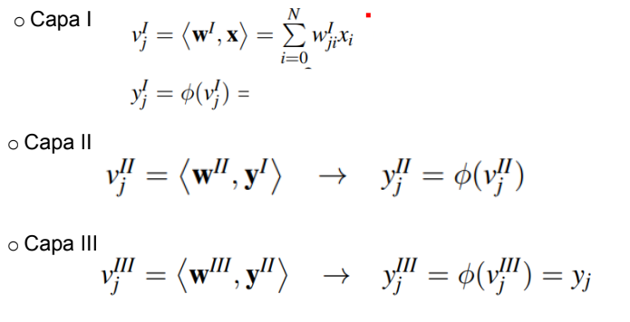

# Redes Neuronales Multicapa y sus Aplicaciones

## Red Neuronal Multicapa

1 Capa  => Medio plano limitado por un hiper plano

2 Capas => Regiones cerradas o convexas

3 Capas => complejidad arbitraria limitada por el numero de neuronas

## Perceptron Multicapa

Se suele entrenar por medio de un algoritmo de retropropagacion de errores o BP (back propagation) de ahi que dichar arquitectura se conozca tambien bajo el nombre de red de retropropagacion.

### Arquitectura

